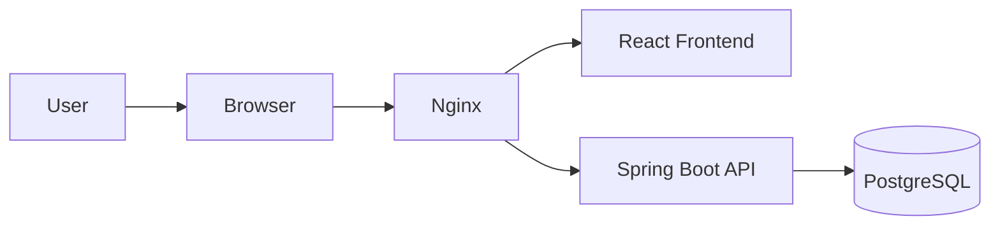
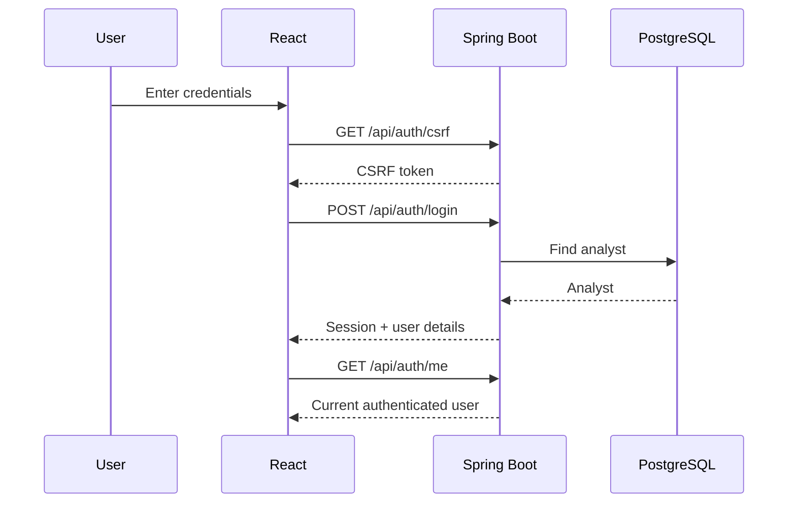
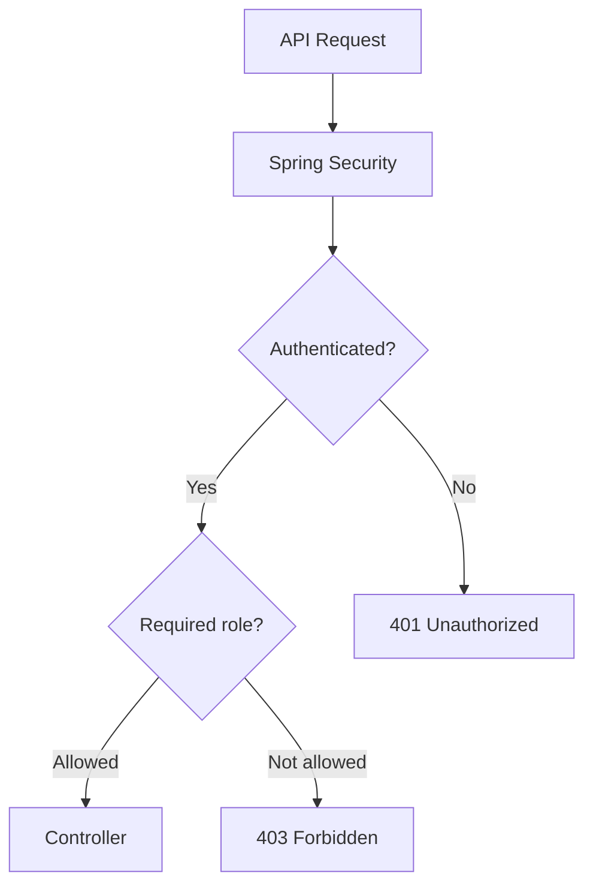
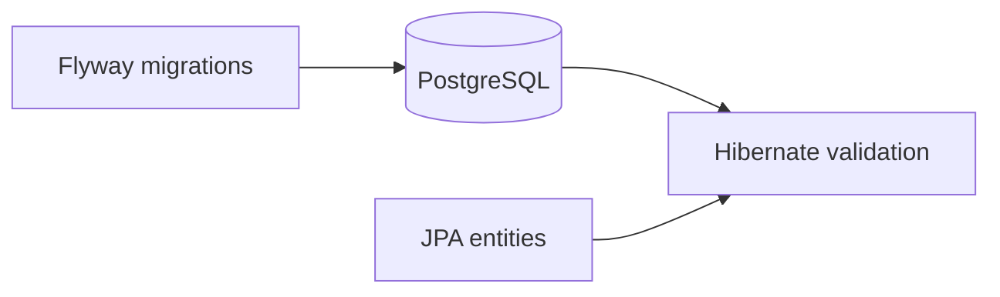
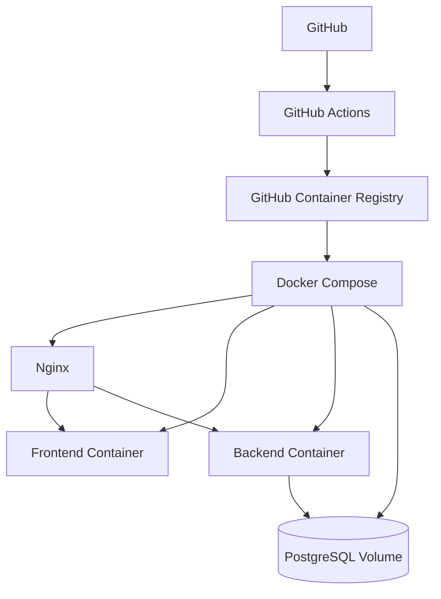

# Sentinel Architecture

## System Overview



Sentinel is a full-stack security event and case management application.

- **React** provides the analyst interface.
- **Nginx** routes frontend and `/api` requests.
- **Spring Boot** handles authentication, authorization and application logic.
- **PostgreSQL** stores analysts, security events and cases.

## Authentication



Authentication uses a server-side Spring Security session.

The browser stores a `JSESSIONID` cookie while the authenticated session remains on the backend.

## Authorization



Sentinel currently supports:

- `ADMIN`
- `ANALYST`

Administrative endpoints under `/api/admin/**` require the `ADMIN` role.

## Database Migrations



Flyway owns production schema changes.

Migration files live in:

```text
src/main/resources/db/migration/
```

Example:

```text
V1__baseline_schema.sql
V2__future_change.sql
V3__future_change.sql
```

Hibernate uses schema validation rather than automatically changing the production database.

## Deployment



GitHub Actions builds and publishes Docker images to GHCR.

Docker Compose runs the production-style stack and supplies environment-specific configuration through `.env`.

Secrets are not committed to Git.
